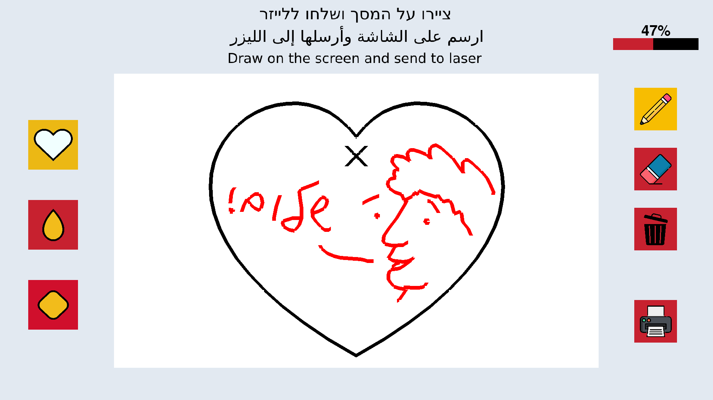

# 🎨 Interactive Laser Drawing Exhibit

The official repository for the interactive drawing exhibit featured at the **Jerusalem Science Museum** (מוזיאון המדע בירושלים). 

Visitors interact with a custom touch screen interface to sketch their own designs. Once complete, the system translates their digital artwork and "prints" it directly onto real satin fabric (בד סאטן) using a laser-controlled plotting mechanism. After that, the visitors can take home their creations (and put it on a necklace, for example)

## ⚠️ Important Notice

> **The `Bezier Version` of this codebase is officially DEPRECATED.** > All active development, maintenance, and the live museum exhibit code are located in the **`regular_version`** directory. Please ensure you are working within this folder.

---

## 🏗️ System Architecture

The project is divided into two main subsystems working in tandem: a Python-based graphical user interface for the touch screen, and an Arduino-based hardware controller.

See also documents under "סיכום" and "שרטוטים" for more infornation (תיק מוצג וסכמה אלקטרונית)

### 1. The Frontend UI (Python)
Located in `regular_version/python/`, this handles all visitor interactions, rendering, and job dispatching.
* **`main.py` & `ui.py`**: The core application logic and the touch-screen canvas interface.
* **`laser.py`**: Handles the translation of digital strokes and frame data into machine-readable instructions.
* **`button.py` & `asset_loader.py`**: Manages the interactive UI elements, loading assets like the drawing tools (pencil, eraser), frames (square, drop, heart), and the "Print" command.
* **`frames/`**: Contains coordinate sequences for predefined geometric frames.
* **`drawings/`**: A local archive where visitor creations are saved as timestamped images for logging.

### 2. The Hardware Controller (Arduino)
Located in `regular_version/arduino/Laser-Drawing-Regular/`, this firmware receives commands from the Python host and physically drives the exhibit.
* **`Laser-Drawing-Regular.ino`**: The main entry point for the microcontroller, orchestrating the physical movement and laser firing.
* **`parser.ino` & `parser.h`**: Responsible for interpreting the incoming serial data stream from the Python backend.
* **`basic_routines.ino`**: Contains the lower-level hardware control logic for stepping motors and laser modulation.

---

## ✨ Features

* **Touch-Optimized Canvas:** Intuitive drawing interface designed specifically for museum-goer touch screens.
* **Real-time Digital to Physical:** Seamless serial communication translates pixel data into precise physical laser movements.
* **Satin Fabric Output:** Specialized handling to safely and beautifully etch/draw onto delicate satin material.
* **Auto-Logging:** Every masterpiece is saved locally as a `.png` for historical records and museum archives.

---

## 🚀 Setup & Installation (Regular Version)

### Software Requirements (Python)
1. Navigate to the Python directory: `cd regular_version/python`
2. Ensure you have Python 3.10+ installed.
3. Install the required dependencies using the provided requirements file:
   ```bash
   pip install -r requirements.txt
4. Run the interface: `python3 main.py`

### Hardware Requirements (Arduino)
1. Open `regular_version/arduino/Laser-Drawing-Regular/Laser-Drawing-Regular.ino` in the Arduino IDE.
2. Ensure the correct board and port are selected.
3. Compile and upload the firmware to the microcontroller.
4. Ensure the serial connection matches the baud rate defined in the Python `consts.py` and Arduino `consts.h` files.

---

## 🛠️ Maintenance & Troubleshooting
* **Logs:** Check `regular_version/python/logs/log.txt` for any serial communication dropouts or application errors.
* **Asset Changes:** To update UI buttons or elements, you can change position and size of almost anything under `ui.py`

---

Active Maintainer: Amitai Ben Shalom

Feel free to contact me about anything related to this exhibit: amitaiami22@gmail.com, I would love to help.

*Created for the Jerusalem Science Museum*


